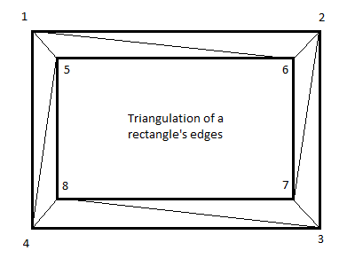
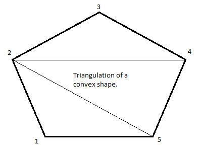
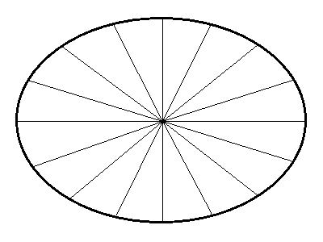

# Figures for 2D shade

## Triangulations

Triangulation of a Rectangle's edges.

Triangulation of a convex polygon.

Triangulation of an ellipse.

FIXME! Reflect the fact that ellipses are approximated through regular polygons in the API.
